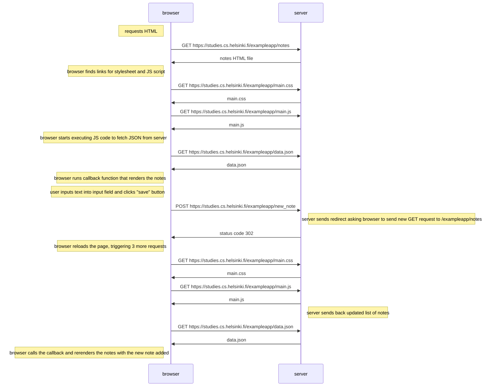
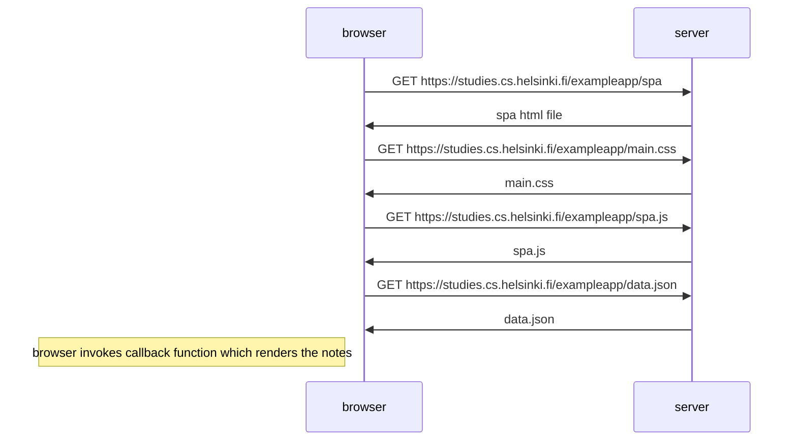
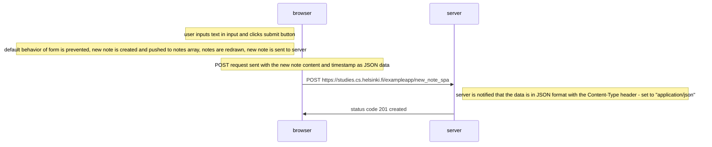

### 0.4 - New Note

```mermaid
sequenceDiagram
  participant browser
  participant server

  Note left of browser: requests HTML
  browser->>server: GET https://studies.cs.helsinki.fi/exampleapp/notes
  server->>browser: notes HTML file

  Note left of browser: browser finds links for stylesheet and JS script

  browser->>server: GET https://studies.cs.helsinki.fi/exampleapp/main.css
  server->>browser: main.css

  browser->>server: GET https://studies.cs.helsinki.fi/exampleapp/main.js
  server->>browser: main.js

  Note left of browser: browser starts executing JS code to fetch JSON from server
  browser->>server: GET https://studies.cs.helsinki.fi/exampleapp/data.json
  server->>browser: data.json

  Note left of browser: browser runs callback function that renders the notes

  Note left of browser: user inputs text into input field and clicks "save" button
  browser->>server: POST https://studies.cs.helsinki.fi/exampleapp/new_note
  Note right of server: server sends redirect asking browser to send new GET request to /exampleapp/notes
  server->>browser: status code 302
  Note left of browser: browser reloads the page, triggering 3 more requests
  browser->>server: GET https://studies.cs.helsinki.fi/exampleapp/main.css
  server->>browser: main.css

  browser->>server: GET https://studies.cs.helsinki.fi/exampleapp/main.js
  server->>browser: main.js

  Note right of server: server sends back updated list of notes
  browser->>server: GET https://studies.cs.helsinki.fi/exampleapp/data.json
  server->>browser: data.json

  Note left of browser: browser calls the callback and rerenders the notes with the new note added
```

### 0.5 - Single Page Application

```mermaid
  sequenceDiagram
    participant browser
    participant server

    browser->>server: GET https://studies.cs.helsinki.fi/exampleapp/spa
    server->>browser: spa html file

    browser->>server: GET https://studies.cs.helsinki.fi/exampleapp/main.css
    server->>browser: main.css

    browser->>server: GET https://studies.cs.helsinki.fi/exampleapp/spa.js
    server->>browser: spa.js

    browser->>server: GET https://studies.cs.helsinki.fi/exampleapp/data.json
    server->>browser: data.json
    Note left of browser: browser invokes callback function which renders the notes

```

### 0.6 - New Note SPA

```mermaid
  sequenceDiagram
    participant browser
    participant server

    Note left of browser: user inputs text in input and clicks submit button
    Note left of browser: default behavior of form is prevented, new note is created and pushed to notes array, notes are redrawn, new note is sent to server

    Note over browser: POST request sent with the new note content and timestamp as JSON data
    browser->>server: POST https://studies.cs.helsinki.fi/exampleapp/new_note_spa

    Note right of server: server is notified that the data is in JSON format with the Content-Type header - set to "application/json"
    server->>browser: status code 201 created


```
